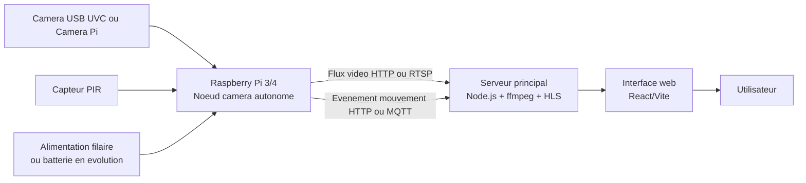

# Noeud Camera Raspberry Pi

Ce document decrit une option simple et stable pour ajouter un noeud camera autonome au projet de surveillance, sans brancher la camera directement au serveur principal.

## Objectif

Construire un petit systeme embarque qui :

- capture la video localement
- detecte un mouvement avec un capteur PIR
- envoie le flux video au serveur principal via le reseau
- peut continuer a fonctionner de maniere fiable avec une alimentation classique par cable

## Architecture recommandee

Materiel conseille :

- Raspberry Pi 4 ou Raspberry Pi 3
- camera USB UVC ou camera officielle Raspberry Pi
- capteur PIR de mouvement
- alimentation par cable
- connexion reseau en Wi-Fi ou Ethernet selon l'installation

Architecture logique :

1. Le Raspberry Pi capture la video.
2. Le Raspberry Pi lit le capteur PIR.
3. Le Raspberry Pi expose un flux video local, par exemple en HTTP ou RTSP.
4. Le serveur principal du projet recupere ce flux et l'affiche dans l'interface.
5. Le Raspberry Pi peut aussi envoyer un evenement de mouvement au serveur.

## Tout se branche sur le Raspberry Pi 3

Oui, dans cette architecture, tout se branche sur le Raspberry Pi 3.

Le Raspberry Pi 3 devient le noeud camera autonome.

Concretement :

1. La camera se branche sur le Raspberry Pi 3.
2. Le capteur PIR se branche sur les GPIO du Raspberry Pi 3.
3. L'alimentation alimente le Raspberry Pi 3.
4. Le Raspberry Pi 3 envoie ensuite le flux video et les evenements mouvement au serveur principal via le reseau.

Le schema logique est donc :

1. camera -> Raspberry Pi 3
2. PIR -> Raspberry Pi 3
3. alimentation -> Raspberry Pi 3
4. Raspberry Pi 3 -> Wi-Fi ou Ethernet -> serveur principal

## Deux variantes de montage camera

### Variante 1 - Webcam USB UVC + PIR

Montage :

1. brancher la webcam sur un port USB du Raspberry Pi 3
2. brancher le capteur PIR sur les GPIO
3. alimenter le Raspberry Pi 3
4. connecter le Raspberry Pi 3 au reseau

Avantages :

- tres simple a mettre en place
- pas de nappe camera
- webcam souvent detectee automatiquement sous Linux

### Variante 2 - Camera officielle Raspberry Pi + PIR

Montage :

1. brancher la camera officielle sur le port CSI du Raspberry Pi 3
2. brancher le capteur PIR sur les GPIO
3. alimenter le Raspberry Pi 3
4. connecter le Raspberry Pi 3 au reseau

Avantages :

- montage plus propre
- systeme plus compact
- approche tres coherente pour un noeud embarque

## Pourquoi cette solution est adaptee au TFE

Cette approche est interessante pour un TFE parce qu'elle montre une vraie architecture distribuee :

- un noeud camera autonome
- un serveur central de supervision
- une interface de visualisation

Elle est aussi plus defendable qu'une camera cloud grand public, car :

- le flux est sous controle local
- le materiel est maitrise
- la logique de detection peut etre expliquee clairement
- la resilience peut etre discutee proprement

## Pourquoi un Raspberry Pi plutot qu'un Pico

Un Raspberry Pi Pico ne suffit pas pour ce besoin si tu veux un vrai flux video exploitable par ton projet.

Raison principale :

- le Pico est un microcontroleur
- il n'est pas concu pour capturer, encoder et diffuser proprement un flux video reseau comme un mini-ordinateur Linux

En pratique, le Pico peut convenir pour :

- lire un capteur PIR
- piloter des petits composants
- envoyer un etat simple au serveur

Mais il n'est pas adapte pour :

- gerer une webcam USB UVC
- faire tourner `ffmpeg`
- heberger un service video propre
- fournir une integration video stable pour ce projet

Conclusion :

- pour un simple detecteur de mouvement, un Pico peut suffire
- pour un noeud camera complet, il faut un Raspberry Pi

## Pi 3, Pi 4 ou Zero 2 W

### Raspberry Pi 4

Le meilleur choix si tu veux de la marge et de la stabilite.

Avantages :

- plus a l'aise pour la video
- meilleur comportement avec `ffmpeg`
- plus fiable pour une demo et un TFE

### Raspberry Pi 3

Bon compromis si tu en trouves un a bon prix.

Avantages :

- suffisant pour un noeud camera simple
- plus accessible que le Pi 4 en occasion

### Raspberry Pi Zero 2 W

Possible, mais plus limite.

Avantages :

- compact
- faible consommation

Limites :

- moins de marge pour l'encodage video
- plus sensible aux choix de resolution et de debit

## Camera conseillee

Deux options coherentes :

### Webcam USB UVC

Avantages :

- tres simple a brancher
- bien supportee sous Linux
- pas d'electronique compliquee
- facile a tester

Inconvenients :

- parfois moins propre qu'un module camera officiel
- qualite variable selon le modele

### Camera officielle Raspberry Pi

Avantages :

- integration plus propre
- montage plus compact
- solution tres adaptee a un systeme embarque

Inconvenients :

- un peu moins plug-and-play qu'une webcam USB
- demande la nappe CSI et un montage plus soigne

## Capteur de mouvement

Le plus simple est un capteur PIR classique, par exemple un HC-SR501.

Fonctionnement :

- le PIR detecte un mouvement
- une broche GPIO du Raspberry Pi lit l'etat du capteur
- un script local peut ensuite prevenir le serveur principal

## Branchement simplifie du PIR

Branchement typique d'un PIR :

- VCC vers 5V ou 3.3V selon le modele
- GND vers GND
- OUT vers une entree GPIO du Raspberry Pi

Exemple simple sur Raspberry Pi 3 :

- VCC -> pin 2 ou pin 4 (5V) si le capteur le supporte
- GND -> pin 6
- OUT -> GPIO17, soit pin physique 11

Autrement dit :

1. la webcam USB va sur un port USB, ou la camera officielle va sur CSI
2. le PIR va sur l'alimentation et une entree GPIO
3. tout converge vers le Raspberry Pi 3

Important :

- verifier la tension de sortie du capteur avant raccordement GPIO
- bien respecter la documentation du PIR utilise

## Alimentation

Pour une premiere version stable, il est conseille de rester sur une alimentation par cable.

Pourquoi :

- plus simple a mettre en place
- plus stable
- plus facile a defendre dans le TFE
- moins de complexite qu'un systeme sur batterie

La batterie peut etre une evolution future, mais pas le point de depart ideal.

## Reseau

Deux options :

- Ethernet si le montage le permet
- Wi-Fi si tu veux plus de souplesse d'installation

Pour la resilience, Ethernet reste preferable.

## Niveau de difficulte

### Electronique

Difficulte faible a moyenne.

Tu dois surtout :

- brancher la camera
- brancher le capteur PIR
- alimenter le Raspberry Pi

### Systeme et code

Difficulte moyenne, mais raisonnable.

Tu dois surtout :

- installer Raspberry Pi OS
- verifier que la camera est detectee
- exposer un flux video local
- lire le capteur PIR
- envoyer l'etat au serveur principal si besoin

## Integration avec le projet actuel

Le projet actuel peut deja consommer des flux distants HTTP ou RTSP, ce qui rend cette architecture pertinente.

L'idee est donc :

1. Le Raspberry Pi expose un flux video.
2. Le serveur principal ajoute ce flux comme une camera normale.
3. L'interface affiche le rendu sans changer toute l'architecture.

L'ajout du capteur PIR peut etre gere en plus, via :

- un appel HTTP vers le serveur principal
- ou un mecanisme type MQTT si tu veux aller plus loin

## Perimetre TFE recommande

Pour un TFE, le plus important est de garder un perimetre solide et demonstrable.

Version recommandee pour la V1 :

1. un seul noeud camera autonome
2. un Raspberry Pi 3 ou 4
3. une camera USB UVC ou une camera officielle Pi
4. un capteur PIR
5. un flux video remonte vers le serveur principal
6. un evenement mouvement remonte au serveur principal
7. un affichage dans l'interface existante

Ce perimetre est bon parce qu'il permet de montrer :

- l'acquisition video
- la detection locale
- la transmission reseau
- la supervision centralisee
- une logique de resilience de base

Extension possible pour la suite :

1. plusieurs noeuds camera
2. alimentation secourue
3. notifications temps reel
4. enregistrement conditionne par mouvement

## Architecture finale recommandee

Pour ce projet, l'architecture la plus coherente est la suivante :

1. le Raspberry Pi joue le role de noeud embarque
2. il capture la video depuis la camera
3. il lit le PIR sur GPIO
4. il expose un flux reseau local vers le serveur principal
5. il envoie un evenement quand un mouvement est detecte
6. le serveur principal integre ce flux comme une camera classique et l'affiche dans l'interface

Choix recommande :

1. Raspberry Pi 4 si disponible, sinon Raspberry Pi 3
2. webcam USB UVC si tu veux aller vite
3. Ethernet si possible pour la stabilite
4. PIR HC-SR501 pour la detection de mouvement
5. alimentation filaire dans la premiere version

## Liste de materiel minimale

Materiel minimum pour une version credible :

1. 1 Raspberry Pi 3 ou 4
2. 1 alimentation stable compatible Raspberry Pi
3. 1 carte microSD
4. 1 camera USB UVC ou 1 camera officielle Pi
5. 1 capteur PIR HC-SR501
6. 3 fils Dupont femelle-femelle ou femelle-male selon le montage
7. 1 acces reseau Wi-Fi ou Ethernet

Materiel recommande si budget disponible :

1. boitier pour le Raspberry Pi
2. dissipateur ou ventilation legere
3. cable Ethernet
4. petite alimentation de secours pour routeur et Raspberry Pi

## Schema d'architecture

Le schema suivant peut etre reutilise dans le rapport ou la soutenance.



## Strategie de developpement

Il est recommande de realiser le projet en petites etapes, dans cet ordre :

1. faire fonctionner le Raspberry Pi avec la camera seule
2. verifier que le flux video est lisible localement
3. connecter ce flux au serveur principal
4. brancher le capteur PIR
5. envoyer un evenement mouvement au serveur
6. afficher l'etat mouvement dans l'interface
7. ajouter ensuite les mecanismes de reprise apres panne ou redemarrage

Cette progression limite le risque technique.

## Commandes utiles sur le Raspberry Pi

### 1. Mettre le systeme a jour

```bash
sudo apt update
sudo apt upgrade -y
```

### 2. Installer les outils video et Python

```bash
sudo apt install -y ffmpeg v4l-utils python3 python3-pip python3-gpiozero curl
```

### 3. Verifier que la camera est detectee

Pour une webcam USB UVC :

```bash
v4l2-ctl --list-devices
ls /dev/video*
```

Si tout va bien, tu devrais voir au moins un peripherique du type `/dev/video0`.

### 4. Tester rapidement la webcam

```bash
ffmpeg -f v4l2 -framerate 25 -video_size 1280x720 -i /dev/video0 -t 10 test.mp4
```

Cette commande enregistre 10 secondes pour verifier que la capture fonctionne.

### 5. Exposer un flux HTTP MJPEG simple

```bash
ffmpeg -f v4l2 -framerate 15 -video_size 1280x720 -i /dev/video0 -f mpjpeg -q:v 6 http://0.0.0.0:8081/feed
```

Remarque : dans une vraie installation, on prefere souvent encapsuler cela dans un service systemd ou utiliser un petit relais local. Cette commande est utile pour les tests rapides.

### 6. Exposer un flux RTSP via un service dedie

Approche recommandee pour une suite propre :

1. installer un service type MediaMTX sur le Raspberry Pi
2. faire pousser le flux de la webcam vers ce service avec `ffmpeg`
3. donner l'URL RTSP au serveur principal

Exemple de publication vers un endpoint RTSP local :

```bash
ffmpeg -f v4l2 -framerate 15 -video_size 1280x720 -i /dev/video0 -vcodec libx264 -preset veryfast -tune zerolatency -f rtsp rtsp://127.0.0.1:8554/cam1
```

Ton serveur principal pourrait ensuite consommer une URL du type :

```text
rtsp://IP_DU_PI:8554/cam1
```

## Evenement mouvement vers le serveur principal

Le plus simple pour la V1 est d'envoyer une requete HTTP au serveur principal quand le PIR detecte un mouvement.

Format recommande :

```json
{
	"deviceId": "pi-cam-01",
	"motion": true,
	"detectedAt": "2026-04-06T18:00:00.000Z"
}
```

Exemple d'endpoint a prevoir cote serveur principal :

```text
POST /api/camera-nodes/motion
```

## Script Python d'exemple pour le PIR

Un exemple de script est fourni dans le depot ici :

- [examples/raspberry-pi-node/pir_sender.py](/c:/Users/theom/Desktop/surveillance/examples/raspberry-pi-node/pir_sender.py)

Ce script :

1. lit un capteur PIR sur `GPIO17`
2. envoie un evenement HTTP au serveur principal
3. applique un delai anti-repetition simple

Execution type :

```bash
python3 examples/raspberry-pi-node/pir_sender.py --server http://IP_DU_SERVEUR:4000 --device-id pi-cam-01
```

## Services a automatiser au demarrage

Pour une version propre du TFE, il faut prevoir au minimum deux services au boot du Raspberry Pi :

1. le service video
2. le script PIR

Exemple de logique :

1. au demarrage, le Pi lance le flux video
2. au demarrage, le Pi lance aussi l'ecoute du PIR
3. si le Pi redemarre apres une coupure, il reprend seul son fonctionnement

## Ce qu'il faudra adapter ensuite dans le projet principal

Pour exploiter pleinement le noeud camera, il faudra ensuite ajouter au projet principal :

1. un endpoint pour recevoir l'etat mouvement
2. un stockage simple du dernier etat mouvement par noeud camera
3. un affichage de cet etat dans l'interface
4. eventuellement un historique des evenements

## Repartition du travail code / systeme / electronique

### Electronique

Niveau estime : faible.

Travail principal :

1. brancher la camera sur le Raspberry Pi
2. brancher le PIR sur VCC, GND et un GPIO
3. assurer une alimentation stable

### Systeme Linux sur le Raspberry Pi

Niveau estime : faible a moyen.

Travail principal :

1. installer Raspberry Pi OS
2. verifier la detection de la camera
3. demarrer automatiquement le service video au boot
4. lancer le script de lecture du PIR

### Code projet

Niveau estime : moyen, mais raisonnable.

Travail principal :

1. consommer le flux emis par le Raspberry Pi
2. ajouter la logique de remontee du mouvement
3. afficher l'etat mouvement dans l'interface
4. eventuellement journaliser les evenements

## Choix recommande pour ton TFE

Si le but est d'avoir un systeme defensable, stable et pas trop risqué, le meilleur choix est :

1. 1 Raspberry Pi 3 ou 4
2. 1 webcam USB UVC de bonne qualite ou une Logitech compatible Linux
3. 1 capteur PIR HC-SR501
4. 1 alimentation filaire
5. 1 liaison reseau vers le serveur principal

Ce choix est plus pertinent qu'une camera cloud grand public, et plus realiste qu'un systeme sur batterie des la premiere version.

## Mise en place recommandee

Pour une version simple et stable :

1. Raspberry Pi 4 si possible, sinon Pi 3
2. Webcam USB UVC ou camera officielle Pi
3. Capteur PIR HC-SR501
4. Alimentation par cable
5. Reseau en Ethernet si possible

## Conclusion

Pour ce projet, la meilleure approche est de considerer la camera comme un sous-systeme autonome base sur Raspberry Pi.

Recommandation finale :

- oui pour Raspberry Pi + camera + PIR
- non pour Raspberry Pi Pico comme noeud video principal
- oui pour alimentation par cable dans une premiere version
- oui pour une webcam USB UVC si tu veux aller vite

Si tu veux ensuite faire evoluer le systeme, les prochaines etapes naturelles seraient :

1. ajouter l'envoi d'evenements mouvement au serveur
2. ajouter une reprise automatique apres redemarrage
3. etudier une alimentation de secours
4. passer a plusieurs noeuds camera si le temps et le budget le permettent